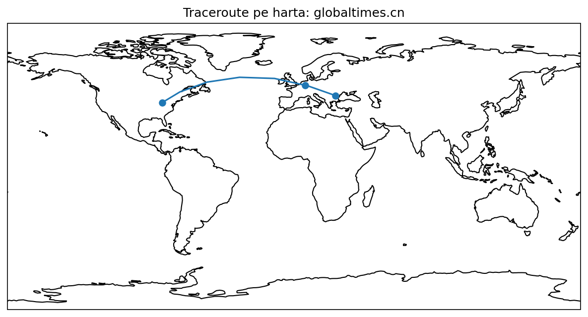
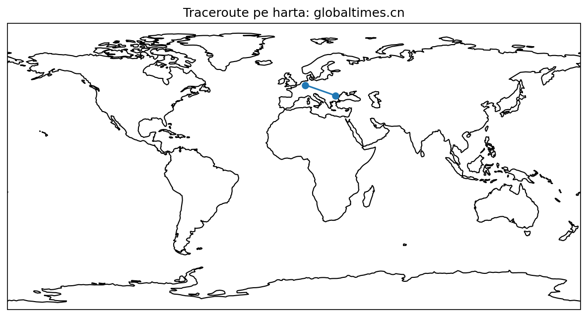
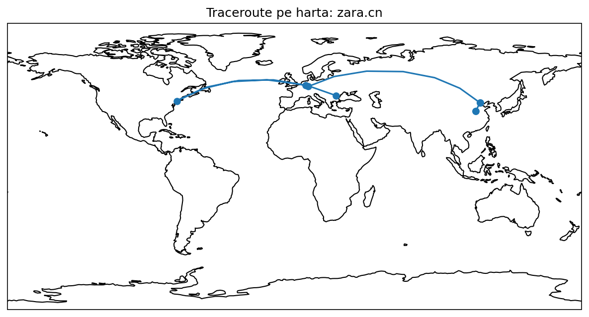
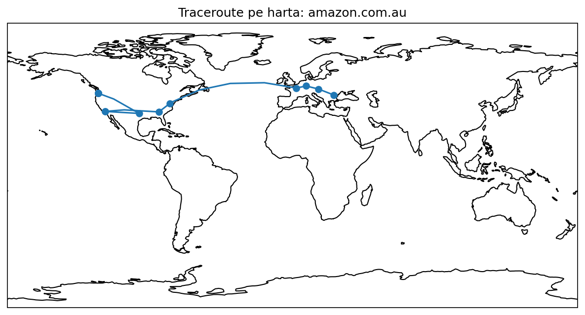
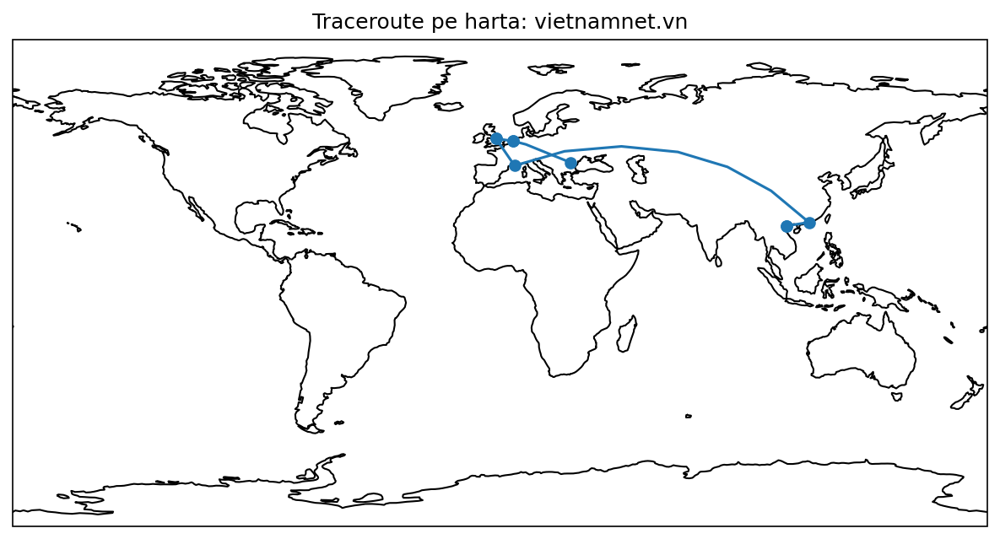
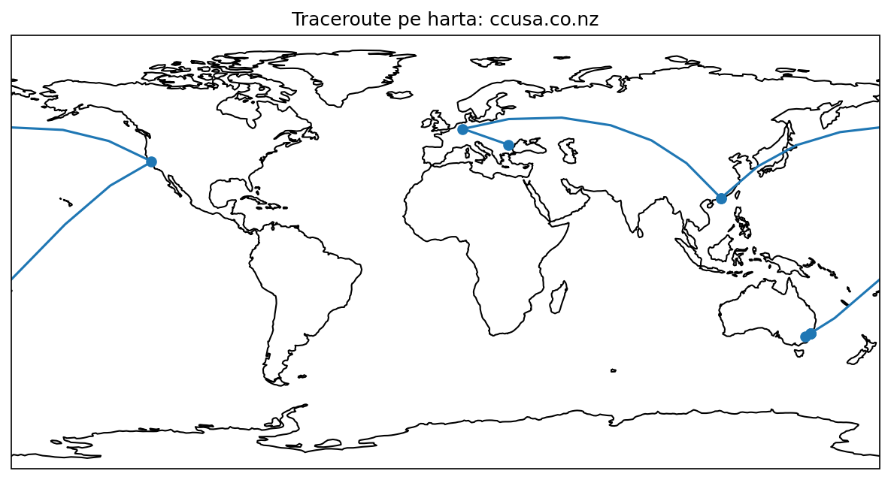
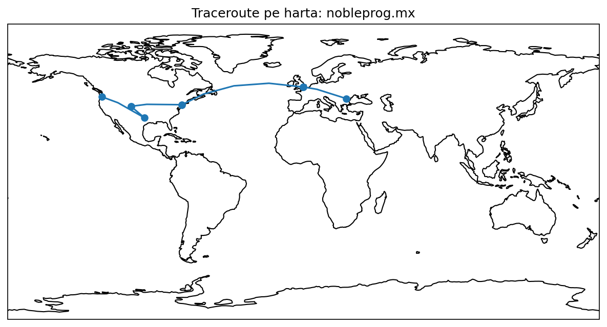
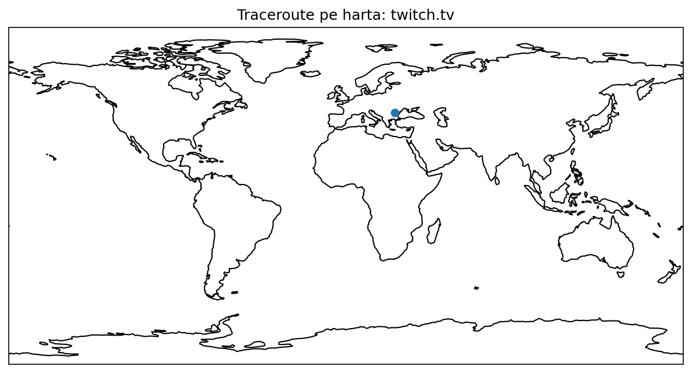

# Raport Traceroute & Geolocație

## 1. Rute catre site-uri din Africa (.za)

### 1.1 yaga.co.za [18.165.171.34]

#### Executat acasa

##### Traseu:

1       192.168.1.1       10.96 ms        7.06 ms        3.99 ms       => nu se poate obtine locatia: private range

 2       10.0.20.193        6.96 ms        8.85 ms        4.93 ms       => nu se poate obtine locatia: private range

 3     172.19.216.49        9.11 ms        4.91 ms       11.03 ms       => nu se poate obtine locatia: private range

 4    10.220.177.229        4.91 ms       14.12 ms      126.41 ms       => nu se poate obtine locatia: private range

 5     10.220.191.45       23.55 ms       11.93 ms       13.08 ms       => nu se poate obtine locatia: private range

 6    10.220.158.178       20.51 ms      122.73 ms       15.34 ms       => nu se poate obtine locatia: private range

 7     10.221.100.90       16.78 ms       14.72 ms       12.71 ms       => nu se poate obtine locatia: private range

 8           timeout     timeout     timeout     timeout  
 9           timeout     timeout     timeout     timeout 
 10           timeout     timeout     timeout     timeout
11         127.0.0.1     timeout      917.60 ms     timeout       => nu se poate obtine locatia: reserved range

12           timeout     timeout     timeout     timeout 
13     18.165.171.18     timeout     timeout       12.75 ms       => Bucharest, București, Romania

Ajuns la destinatie!

##### Harta:

#### Executat la facultate

Nu se poate rezolva destinatia: yaga.co.za

#### Executat pe o retea privata

##### Traseu:

 1    192.168.24.114       46.01 ms        9.33 ms        2.77 ms       => nu se poate obtine locatia: private range

 2     10.205.76.243       35.21 ms      209.84 ms      319.26 ms       => nu se poate obtine locatia: private range

 3     10.205.76.242       41.45 ms       31.80 ms       39.12 ms       => nu se poate obtine locatia: private range

 4     10.183.128.38       37.01 ms       31.17 ms       27.07 ms       => nu se poate obtine locatia: private range

 5    10.132.128.138       36.30 ms       31.48 ms       30.55 ms       => nu se poate obtine locatia: private range

 6       10.183.2.17       32.19 ms       32.36 ms       29.74 ms       => nu se poate obtine locatia: private range

 7      10.0.242.197       37.46 ms       40.98 ms       22.30 ms       => nu se poate obtine locatia: private range

 8           timeout     timeout     timeout     timeout  
 9      10.0.244.246      111.52 ms       25.92 ms       38.96 ms       => nu se poate obtine locatia: private range

10           timeout     timeout     timeout     timeout 
11           timeout     timeout     timeout     timeout 
12         127.0.0.1     timeout     2509.50 ms     timeout       => nu se poate obtine locatia: reserved range

13           timeout     timeout     timeout     timeout 
14           timeout     timeout     timeout     timeout 
15     18.165.171.34     timeout     timeout      117.55 ms       => Bucharest, București, Romania
Ajuns la destinatie!

##### Harta:

### 1.2 news.co.za [176.58.126.155]

#### Executat acasa

##### Traseu:

 1       192.168.1.1        4.95 ms        3.16 ms        4.51 ms       => nu se poate obtine locatia: private range

 2       10.0.20.193        3.57 ms        4.11 ms        5.71 ms       => nu se poate obtine locatia: private range

 3       10.30.0.225        4.05 ms        4.42 ms        5.69 ms       => nu se poate obtine locatia: private range

 4    10.220.185.116        3.55 ms        5.58 ms        4.41 ms       => nu se poate obtine locatia: private range

 5    10.220.158.136        7.57 ms        5.76 ms        6.22 ms       => nu se poate obtine locatia: private range

 6           timeout     timeout     timeout     timeout  
 7      10.221.96.19       47.53 ms       46.01 ms       46.15 ms       => nu se poate obtine locatia: private range
 
 8     195.66.225.73       45.04 ms       82.84 ms       48.36 ms       => London, England, United Kingdom
 
 9       10.207.32.1       43.98 ms       43.68 ms       47.20 ms       => nu se poate obtine locatia: private range

10      10.207.35.34       46.23 ms       49.84 ms       43.97 ms       => nu se poate obtine locatia: private range

11       10.207.7.16       47.95 ms       48.84 ms       51.44 ms       => nu se poate obtine locatia: private range

12           timeout     timeout     timeout     timeout 

13           timeout     timeout     timeout     timeout 

14           timeout     timeout     timeout     timeout 

15           timeout     timeout     timeout     timeout 

16           timeout     timeout     timeout     timeout 

17           timeout     timeout     timeout     timeout 

18           timeout     timeout     timeout     timeout 

19           timeout     timeout     timeout     timeout 

20           timeout     timeout     timeout     timeout 

21           timeout     timeout     timeout     timeout 

22           timeout     timeout     timeout     timeout 

23         127.0.0.1     timeout     timeout     3450.88 ms       => nu se poate obtine locatia: reserved range

24         127.0.0.1        0.57 ms       65.12 ms        0.57 ms       => nu se poate obtine locatia: reserved range

25         127.0.0.1     timeout     3969.22 ms     timeout       => nu se poate obtine locatia: reserved range

26           timeout     timeout     timeout     timeout 27         127.0.0.1     timeout     2664.03 ms     timeout       => nu se poate obtine locatia: reserved range

28           timeout     timeout     timeout     timeout 

29           timeout     timeout     timeout     timeout 

30         127.0.0.1     timeout     timeout     4087.27 ms       => nu se poate obtine locatia: reserved range

31           timeout     timeout     timeout     timeout 

32           timeout     timeout     timeout     timeout 

33           timeout     timeout     timeout     timeout 

34           timeout     timeout     timeout     timeout 

35           timeout     timeout     timeout     timeout 

36           timeout     timeout     timeout     timeout 

37           timeout     timeout     timeout     timeout 

38           timeout     timeout     timeout     timeout 

39           timeout     timeout     timeout     timeout 

40           timeout     timeout     timeout     timeout 

41           timeout     timeout     timeout     timeout 

42         127.0.0.1     timeout      640.25 ms        2.85 ms       => nu se poate obtine locatia: reserved range

43           timeout     timeout     timeout     timeout 

44           timeout     timeout     timeout     timeout 

45           timeout     timeout     timeout     timeout 

46           timeout     timeout     timeout     timeout 

47         127.0.0.1     timeout     timeout     4003.62 ms       => nu se poate obtine locatia: reserved range

48         127.0.0.1        0.60 ms     timeout     timeout       => nu se poate obtine locatia: reserved range

49           timeout     timeout     timeout     timeout 

50           timeout     timeout     timeout     timeout 

51         127.0.0.1     timeout     timeout     4372.75 ms       => nu se poate obtine locatia: reserved range

52           timeout     timeout     timeout     timeout 

53           timeout     timeout     timeout     timeout 

54           timeout     timeout     timeout     timeout 

55           timeout     timeout     timeout     timeout 

56           timeout     timeout     timeout     timeout 

57           timeout     timeout     timeout     timeout 

58           timeout     timeout     timeout     timeout 

59           timeout     timeout     timeout     timeout 

60           timeout     timeout     timeout     timeout 

61           timeout     timeout     timeout     timeout 

62           timeout     timeout     timeout     timeout 

63           timeout     timeout     timeout     timeout 

64           timeout     timeout     timeout     timeout

##### Harta:

#### Executat la facultate

Nu se poate rezolva destinatia: news.co.za

#### Executat pe o retea privata

##### Traseu:

 1    192.168.24.114        9.05 ms       11.35 ms        6.21 ms       => nu se poate obtine locatia: private range
 2     10.205.76.243       84.06 ms      365.60 ms       40.36 ms       => nu se poate obtine locatia: private range
 3     10.205.76.250       49.07 ms       34.15 ms       30.27 ms       => nu se poate obtine locatia: private range
 4     10.183.128.38       30.28 ms       29.44 ms        1.85 ms       => nu se poate obtine locatia: private range
 5     10.183.128.38        2.83 ms       25.57 ms       13.97 ms       => nu se poate obtine locatia: private range
 6    10.132.128.138        1.99 ms       36.14 ms        0.80 ms       => nu se poate obtine locatia: private range
 7       10.183.2.17        8.89 ms       32.50 ms       10.72 ms       => nu se poate obtine locatia: private range
 8      10.0.242.197        1.91 ms     timeout     timeout       => nu se poate obtine locatia: private range
 9        10.0.200.6       65.03 ms       66.02 ms       63.05 ms       => nu se poate obtine locatia: private range
10        10.0.240.9       73.06 ms       62.71 ms       61.90 ms       => nu se poate obtine locatia: private range
11     195.66.225.73       96.94 ms       76.17 ms       72.63 ms       => London, England, United Kingdom
12       10.207.32.2       82.97 ms       79.72 ms       70.09 ms       => nu se poate obtine locatia: private range
13      10.207.35.33       72.54 ms       81.23 ms       71.62 ms       => nu se poate obtine locatia: private range
14       10.207.7.16       92.65 ms        9.65 ms       83.92 ms       => nu se poate obtine locatia: private range
15       10.207.7.16        0.40 ms     timeout     timeout       => eroare obtinere locatie: HTTPConnectionPool
16           timeout     timeout     timeout     timeout 17         127.0.0.1     2792.10 ms        0.81 ms      426.92 ms       => nu se poate obtine locatia: reserved range
18         127.0.0.1        0.99 ms        0.35 ms        0.81 ms       => nu se poate obtine locatia: reserved range
19         127.0.0.1       10.37 ms        3.09 ms     timeout       => nu se poate obtine locatia: reserved range
20           timeout     timeout     timeout     timeout 21           timeout     timeout     timeout     timeout 22           timeout     timeout     timeout     timeout 23           timeout     timeout     timeout     timeout 24           timeout     timeout     timeout     timeout 25           timeout     timeout     timeout     timeout 26           timeout     timeout     timeout     timeout 27         127.0.0.1     timeout      949.46 ms        0.49 ms       => nu se poate obtine locatia: reserved range
28           timeout     timeout     timeout     timeout 29           timeout     timeout     timeout     timeout 30           timeout     timeout     timeout     timeout 31           timeout     timeout     timeout     timeout 32           timeout     timeout     timeout     timeout 33           timeout     timeout     timeout     timeout 34           timeout     timeout     timeout     timeout 35         127.0.0.1     timeout     timeout     1509.78 ms       => nu se poate obtine locatia: reserved range
36           timeout     timeout     timeout     timeout 37           timeout     timeout     timeout     timeout 38           timeout     timeout     timeout     timeout 39           timeout     timeout     timeout     timeout 40         127.0.0.1     2445.38 ms     timeout     timeout       => nu se poate obtine locatia: reserved range
41           timeout     timeout     timeout     timeout 42           timeout     timeout     timeout     timeout 43           timeout     timeout     timeout     timeout 44           timeout     timeout     timeout     timeout 45           timeout     timeout     timeout     timeout 46           timeout     timeout     timeout     timeout 47           timeout     timeout     timeout     timeout 48           timeout     timeout     timeout     timeout 49           timeout     timeout     timeout     timeout 50           timeout     timeout     timeout     timeout 51           timeout     timeout     timeout     timeout 52           timeout     timeout     timeout     timeout 53         127.0.0.1     timeout     timeout     4038.74 ms       => nu se poate obtine locatia: reserved range
54         127.0.0.1        5.52 ms     timeout     timeout       => nu se poate obtine locatia: reserved range
55           timeout     timeout     timeout     timeout 56           timeout     timeout     timeout     timeout 57         127.0.0.1     timeout     timeout     1404.59 ms       => nu se poate obtine locatia: reserved range
58         127.0.0.1        0.53 ms        0.29 ms        0.35 ms       => nu se poate obtine locatia: reserved range
59           timeout     timeout     timeout     timeout 60           timeout     timeout     timeout     timeout 61           timeout     timeout     timeout     timeout 62           timeout     timeout     timeout     timeout 63         127.0.0.1     timeout     timeout     3412.69 ms       => nu se poate obtine locatia: reserved range
64         127.0.0.1        1.70 ms        1.39 ms        6.60 ms       => nu se poate obtine locatia: reserved range

##### Harta:

## 2. Rute catre site-uri din Asia (.cn)

### 2.1 globaltimes.cn [43.152.26.142]

#### Executat acasa

##### Traseu:

 1       192.168.1.1        4.66 ms        6.96 ms        7.65 ms       => nu se poate obtine locatia: private range
 2       10.0.20.193        7.76 ms        6.01 ms        4.16 ms       => nu se poate obtine locatia: private range
 3     172.19.216.49       12.05 ms       10.07 ms        5.30 ms       => nu se poate obtine locatia: private range
 4    10.220.177.229        9.42 ms        4.92 ms        5.09 ms       => nu se poate obtine locatia: private range
 5     10.220.191.45       16.25 ms       13.24 ms       17.52 ms       => nu se poate obtine locatia: private range
 6    10.221.100.112       14.10 ms       12.60 ms       12.73 ms       => nu se poate obtine locatia: private range
 7      10.221.96.46       33.94 ms       35.69 ms       31.52 ms       => nu se poate obtine locatia: private range
 8     80.81.196.105       27.73 ms       27.29 ms       28.97 ms       => Cologne, North Rhine-Westphalia, Germany
 9     10.201.14.246       42.95 ms     timeout     timeout       => nu se poate obtine locatia: private range
10     30.39.117.237       33.64 ms       31.03 ms       30.27 ms       => Columbus, Ohio, United States
11           timeout     timeout     timeout     timeout 12           timeout     timeout     timeout     timeout 13           timeout     timeout     timeout     timeout 14         127.0.0.1     timeout     timeout     3291.29 ms       => nu se poate obtine locatia: reserved range
15         127.0.0.1        0.39 ms      109.85 ms     timeout       => nu se poate obtine locatia: reserved range
16           timeout     timeout     timeout     timeout 17           timeout     timeout     timeout     timeout 18           timeout     timeout     timeout     timeout 19           timeout     timeout     timeout     timeout 20           timeout     timeout     timeout     timeout 21           timeout     timeout     timeout     timeout 22           timeout     timeout     timeout     timeout 23           timeout     timeout     timeout     timeout 24           timeout     timeout     timeout     timeout 25           timeout     timeout     timeout     timeout 26           timeout     timeout     timeout     timeout 27           timeout     timeout     timeout     timeout 28           timeout     timeout     timeout     timeout 29         127.0.0.1     timeout      280.51 ms     timeout       => nu se poate obtine locatia: reserved range
30           timeout     timeout     timeout     timeout 31           timeout     timeout     timeout     timeout 32           timeout     timeout     timeout     timeout 33           timeout     timeout     timeout     timeout 34           timeout     timeout     timeout     timeout 35           timeout     timeout     timeout     timeout 36           timeout     timeout     timeout     timeout 37           timeout     timeout     timeout     timeout 38           timeout     timeout     timeout     timeout 39           timeout     timeout     timeout     timeout 40           timeout     timeout     timeout     timeout 41           timeout     timeout     timeout     timeout 42           timeout     timeout     timeout     timeout 43           timeout     timeout     timeout     timeout 44           timeout     timeout     timeout     timeout 45           timeout     timeout     timeout     timeout 46           timeout     timeout     timeout     timeout 47           timeout     timeout     timeout     timeout 48           timeout     timeout     timeout     timeout 49         127.0.0.1     timeout     4644.71 ms     timeout       => nu se poate obtine locatia: reserved range
50           timeout     timeout     timeout     timeout 51           timeout     timeout     timeout     timeout 52           timeout     timeout     timeout     timeout 53           timeout     timeout     timeout     timeout 54           timeout     timeout     timeout     timeout 55           timeout     timeout     timeout     timeout 56           timeout     timeout     timeout     timeout 57           timeout     timeout     timeout     timeout 58           timeout     timeout     timeout     timeout 59           timeout     timeout     timeout     timeout 60           timeout     timeout     timeout     timeout 61           timeout     timeout     timeout     timeout 62           timeout     timeout     timeout     timeout 63           timeout     timeout     timeout     timeout 64           timeout     timeout     timeout     timeout

##### Harta:

#### Executat la facultate

Nu se poate rezolva destinatia: globaltimes.cn

#### Executat pe o retea privata

##### Traseu:

 1    192.168.24.114        3.66 ms        4.33 ms        4.44 ms       => nu se poate obtine locatia: private range
 2     10.205.76.243      215.59 ms       29.92 ms      288.93 ms       => nu se poate obtine locatia: private range
 3     10.205.76.242       36.47 ms       34.76 ms       32.36 ms       => nu se poate obtine locatia: private range
 4     10.183.128.38       30.97 ms       32.24 ms       26.78 ms       => nu se poate obtine locatia: private range
 5    10.132.128.138       46.66 ms       33.72 ms       28.62 ms       => nu se poate obtine locatia: private range
 6       10.183.2.17       32.85 ms       29.22 ms       33.35 ms       => nu se poate obtine locatia: private range
 7      10.0.242.197       32.28 ms       24.62 ms       27.52 ms       => nu se poate obtine locatia: private range
 8           timeout     timeout     timeout     timeout  9      10.0.240.190       84.34 ms       55.46 ms       57.60 ms       => nu se poate obtine locatia: private range
10      10.0.240.121       71.79 ms       60.93 ms       69.88 ms       => nu se poate obtine locatia: private range
11     80.81.196.105       80.86 ms       61.82 ms       55.91 ms       => Cologne, North Rhine-Westphalia, Germany
12           timeout     timeout     timeout     timeout 13           timeout     timeout     timeout     timeout 14           timeout     timeout     timeout     timeout 15           timeout     timeout     timeout     timeout 16           timeout     timeout     timeout     timeout 17           timeout     timeout     timeout     timeout 18           timeout     timeout     timeout     timeout 19           timeout     timeout     timeout     timeout 20           timeout     timeout     timeout     timeout 21           timeout     timeout     timeout     timeout 22           timeout     timeout     timeout     timeout 23           timeout     timeout     timeout     timeout 24           timeout     timeout     timeout     timeout 25           timeout     timeout     timeout     timeout 26           timeout     timeout     timeout     timeout 27           timeout     timeout     timeout     timeout 28           timeout     timeout     timeout     timeout 29           timeout     timeout     timeout     timeout 30         127.0.0.1     timeout     3434.50 ms        0.82 ms       => nu se poate obtine locatia: reserved range
31           timeout     timeout     timeout     timeout 32           timeout     timeout     timeout     timeout 33           timeout     timeout     timeout     timeout 34           timeout     timeout     timeout     timeout 35           timeout     timeout     timeout     timeout 36           timeout     timeout     timeout     timeout 37           timeout     timeout     timeout     timeout 38           timeout     timeout     timeout     timeout 39           timeout     timeout     timeout     timeout 40           timeout     timeout     timeout     timeout 41           timeout     timeout     timeout     timeout 42           timeout     timeout     timeout     timeout 43           timeout     timeout     timeout     timeout 44           timeout     timeout     timeout     timeout 45           timeout     timeout     timeout     timeout 46           timeout     timeout     timeout     timeout 47           timeout     timeout     timeout     timeout 48           timeout     timeout     timeout     timeout 49           timeout     timeout     timeout     timeout 50           timeout     timeout     timeout     timeout 51           timeout     timeout     timeout     timeout 52           timeout     timeout     timeout     timeout 53           timeout     timeout     timeout     timeout 54           timeout     timeout     timeout     timeout 55         127.0.0.1      163.39 ms       21.04 ms     timeout       => nu se poate obtine locatia: reserved range
56           timeout     timeout     timeout     timeout 57           timeout     timeout     timeout     timeout 58           timeout     timeout     timeout     timeout 59           timeout     timeout     timeout     timeout 60           timeout     timeout     timeout     timeout 61           timeout     timeout     timeout     timeout 62         127.0.0.1     timeout     2738.34 ms     timeout       => nu se poate obtine locatia: reserved range
63           timeout     timeout     timeout     timeout 64           timeout     timeout     timeout 

##### Harta: 

### 2.2 zara.cn [222.138.5.24]

#### Executat acasa

##### Traseu:

 1       192.168.1.1        3.08 ms        2.87 ms        2.67 ms       => nu se poate obtine locatia: private range
 2       10.0.20.193       11.48 ms        7.05 ms        4.90 ms       => nu se poate obtine locatia: private range
 3     172.19.216.49        4.41 ms        4.47 ms        6.99 ms       => nu se poate obtine locatia: private range
 4    10.220.177.227        5.06 ms        7.57 ms        8.94 ms       => nu se poate obtine locatia: private range
 5     10.220.191.45       17.64 ms       12.19 ms       11.59 ms       => nu se poate obtine locatia: private range
 6    10.221.100.112       15.97 ms       12.31 ms       11.30 ms       => nu se poate obtine locatia: private range
 7      10.221.96.48       33.67 ms       29.30 ms       31.80 ms       => nu se poate obtine locatia: private range
 8       62.67.18.61       38.71 ms       56.84 ms     timeout       => Frankfurt am Main, Hesse, Germany
 9      62.67.23.222       31.54 ms       31.74 ms       32.55 ms       => Frankfurt am Main, Hesse, Germany
10      23.197.78.92       27.72 ms       34.48 ms       27.72 ms       => Marseille, Provence-Alpes-Côte d'Azur, France
11      23.210.52.48       41.64 ms       35.56 ms       31.05 ms       => Frankfurt am Main, Hesse, Germany
12    95.100.192.149       40.41 ms       42.82 ms       31.65 ms       => Düsseldorf, North Rhine-Westphalia, Germany
13      23.223.63.35       55.95 ms       37.95 ms       64.09 ms       => Berlin, State of Berlin, Germany
14     23.223.63.147      195.67 ms      180.80 ms       41.07 ms       => Berlin, State of Berlin, Germany
15       2.21.133.67       41.79 ms       => Berlin, State of Berlin, Germany
Ajuns la destinatie!

##### Harta:

#### Executat la facultate

Nu se poate rezolva destinatia: zara.cn

#### Executat pe o retea privata

##### Traseu:

 1    192.168.24.114        6.06 ms        6.62 ms        4.82 ms       => nu se poate obtine locatia: private range
 2     10.205.76.243       28.55 ms      282.53 ms      318.60 ms       => nu se poate obtine locatia: private range
 3     10.205.76.250       26.36 ms       30.71 ms       28.40 ms       => nu se poate obtine locatia: private range
 4     10.183.128.38       29.41 ms       33.16 ms       27.52 ms       => nu se poate obtine locatia: private range
 5    10.132.128.138       34.85 ms       36.67 ms       29.53 ms       => nu se poate obtine locatia: private range
 6       10.183.2.17       50.60 ms       39.03 ms       30.79 ms       => nu se poate obtine locatia: private range
 7      10.0.242.197       43.00 ms       34.00 ms       45.91 ms       => nu se poate obtine locatia: private range
 8           timeout     timeout     timeout     timeout  9       10.0.240.22       94.88 ms       64.11 ms       57.66 ms       => nu se poate obtine locatia: private range
10      10.0.240.117       53.25 ms       57.01 ms       64.09 ms       => nu se poate obtine locatia: private range
11       80.81.193.1       69.51 ms       67.74 ms       59.76 ms       => Cologne, North Rhine-Westphalia, Germany
12    140.222.236.59       61.52 ms       78.43 ms       64.71 ms       => Harrison, New York, United States
13      139.4.15.178      164.61 ms      173.98 ms      159.78 ms       => Frankfurt am Main, Hesse, Germany
14      219.158.5.25      307.93 ms      479.89 ms     timeout       => Jinrongjie, Beijing, China
15      219.158.9.89      292.51 ms      475.50 ms      319.98 ms       => Jinrongjie, Beijing, China
16     219.158.9.201      455.17 ms     timeout     timeout       => Jinrongjie, Beijing, China
17           timeout     timeout     timeout     timeout 18     61.168.192.38      344.86 ms      437.55 ms      325.93 ms       => Zhengzhou, Henan, China
19           timeout     timeout     timeout     timeout 20           timeout     timeout     timeout     timeout 21      222.138.5.24      442.13 ms       => Zhengzhou, Henan, China
Ajuns la destinatie!

##### Harta:

## 3. Rute catre site-uri din Australia (.au)

### 3.1 amazon.com.au [52.119.171.206]

#### Executat acasa

##### Traseu:

 1       192.168.1.1        9.19 ms        7.51 ms        2.67 ms       => nu se poate obtine locatia: private range
 2       10.0.20.193        4.92 ms       13.55 ms        6.36 ms       => nu se poate obtine locatia: private range
 3       10.30.0.225        7.06 ms        7.01 ms        8.19 ms       => nu se poate obtine locatia: private range
 4    10.220.185.118        9.23 ms        5.78 ms        7.01 ms       => nu se poate obtine locatia: private range
 5    10.220.130.114       12.95 ms        5.74 ms        7.96 ms       => nu se poate obtine locatia: private range
 6           timeout     timeout     timeout     timeout  7         127.0.0.1     4840.83 ms        4.85 ms     timeout       => nu se poate obtine locatia: reserved range
 8    62.115.114.110       22.90 ms     timeout       22.64 ms       => Vienna, Vienna, Austria
 9    62.115.137.202       33.34 ms       30.77 ms       34.92 ms       => Frankfurt am Main, Hesse, Germany
10     62.115.123.13       42.94 ms       41.29 ms       41.88 ms       => Paris, Île-de-France, France
11    62.115.140.107     timeout     timeout      121.72 ms       => Ashburn, Virginia, United States
12     62.115.138.71      183.70 ms      177.89 ms     timeout       => Atlanta, Georgia, United States
13     62.115.137.62     timeout      175.35 ms      180.93 ms       => Los Angeles, California, United States
14    62.115.140.227     timeout      174.74 ms      186.42 ms       => Los Angeles, California, United States
15    62.115.140.236      178.19 ms     timeout      183.98 ms       => Dallas, Texas, United States
16           timeout     timeout     timeout     timeout 17           timeout     timeout     timeout     timeout 18         127.0.0.1     timeout     3936.60 ms        3.85 ms       => nu se poate obtine locatia: reserved range
19     108.166.236.2     timeout      196.82 ms     timeout       => Portland, Oregon, United States
20     108.166.240.2     timeout      197.18 ms     timeout       => Portland, Oregon, United States
21    108.166.240.35      199.24 ms      195.52 ms      206.71 ms       => Portland, Oregon, United States
22    108.166.240.56      200.73 ms      195.09 ms      210.61 ms       => Portland, Oregon, United States
23    108.166.240.24      203.41 ms     timeout      208.05 ms       => Portland, Oregon, United States
24    108.166.240.19     timeout     timeout      207.28 ms       => Portland, Oregon, United States
25           timeout     timeout     timeout     timeout 26           timeout     timeout     timeout     timeout 27           timeout     timeout     timeout     timeout 28           timeout     timeout     timeout     timeout 29         127.0.0.1     timeout     timeout     2447.20 ms       => nu se poate obtine locatia: reserved range
30           timeout     timeout     timeout     timeout 31           timeout     timeout     timeout     timeout 32           timeout     timeout     timeout     timeout 33           timeout     timeout     timeout     timeout 34           timeout     timeout     timeout     timeout 35           timeout     timeout     timeout     timeout 36           timeout     timeout     timeout     timeout 37           timeout     timeout     timeout     timeout 38           timeout     timeout     timeout     timeout 39           timeout     timeout     timeout     timeout 40           timeout     timeout     timeout     timeout 41           timeout     timeout     timeout     timeout 42         127.0.0.1     timeout     3216.51 ms        0.71 ms       => nu se poate obtine locatia: reserved range
43           timeout     timeout     timeout     timeout 44           timeout     timeout     timeout     timeout 45           timeout     timeout     timeout     timeout 46           timeout     timeout     timeout     timeout 47         127.0.0.1      206.03 ms        2.08 ms     timeout       => nu se poate obtine locatia: reserved range
48           timeout     timeout     timeout     timeout 49           timeout     timeout     timeout     timeout 50           timeout     timeout     timeout     timeout 51         127.0.0.1      549.28 ms     timeout     timeout       => nu se poate obtine locatia: reserved range
52           timeout     timeout     timeout     timeout 53           timeout     timeout     timeout     timeout 54           timeout     timeout     timeout     timeout 55           timeout     timeout     timeout     timeout 56           timeout     timeout     timeout     timeout 57           timeout     timeout     timeout     timeout 58           timeout     timeout     timeout     timeout 59           timeout     timeout     timeout     timeout 60           timeout     timeout     timeout     timeout 61           timeout     timeout     timeout     timeout 62           timeout     timeout     timeout     timeout 63           timeout     timeout     timeout     timeout 64           timeout     timeout     timeout     timeout

##### Harta:

#### Executat la facultate

Nu se poate rezolva destinatia: amazon.com.au

#### Executat pe o retea privata

##### Traseu:

 1    192.168.24.114        4.90 ms        3.10 ms        5.82 ms       => nu se poate obtine locatia: private range
 2     10.205.76.243       30.40 ms      312.88 ms      161.06 ms       => nu se poate obtine locatia: private range
 3     10.205.76.250       33.96 ms       26.58 ms       38.41 ms       => nu se poate obtine locatia: private range
 4     10.183.128.38       27.55 ms       30.77 ms       32.26 ms       => nu se poate obtine locatia: private range
 5    10.132.128.138       46.56 ms       32.32 ms       31.67 ms       => nu se poate obtine locatia: private range
 6       10.183.2.17       30.05 ms       30.02 ms       29.67 ms       => nu se poate obtine locatia: private range
 7      10.0.242.197       29.11 ms       23.41 ms       29.95 ms       => nu se poate obtine locatia: private range
 8         127.0.0.1       12.00 ms        4.62 ms       16.19 ms       => nu se poate obtine locatia: reserved range
 9         127.0.0.1        3.19 ms       59.16 ms        2.37 ms       => nu se poate obtine locatia: reserved range
10      10.0.240.190        0.81 ms       57.14 ms        3.05 ms       => nu se poate obtine locatia: private range
11      10.0.240.145        1.04 ms       54.22 ms        1.38 ms       => nu se poate obtine locatia: private range
12    62.115.156.162        2.12 ms       54.96 ms        0.72 ms       => Frankfurt am Main, Hesse, Germany
13    62.115.124.116        0.41 ms       77.46 ms        1.39 ms       => Frankfurt am Main, Hesse, Germany
14     62.115.123.13        0.37 ms     timeout     timeout       => Paris, Île-de-France, France
15     62.115.138.71      209.13 ms      212.18 ms      297.90 ms       => Atlanta, Georgia, United States
16    62.115.140.226     timeout      275.24 ms     timeout       => Los Angeles, California, United States
17           timeout     timeout     timeout     timeout 18    62.115.140.236     timeout     timeout      362.05 ms       => Dallas, Texas, United States
19           timeout     timeout     timeout     timeout 20           timeout     timeout     timeout     timeout 21           timeout     timeout     timeout     timeout 22           timeout     timeout     timeout     timeout 23         127.0.0.1     timeout     1783.29 ms     timeout       => nu se poate obtine locatia: reserved range
24     108.166.236.3      295.42 ms     timeout      274.32 ms       => Portland, Oregon, United States
25           timeout     timeout     timeout     timeout 26           timeout     timeout     timeout     timeout 27           timeout     timeout     timeout     timeout 28           timeout     timeout     timeout     timeout 29           timeout     timeout     timeout     timeout 30           timeout     timeout     timeout     timeout 31           timeout     timeout     timeout     timeout 32           timeout     timeout     timeout     timeout 33         127.0.0.1     2405.14 ms        8.11 ms     timeout       => nu se poate obtine locatia: reserved range
34           timeout     timeout     timeout     timeout 35           timeout     timeout     timeout     timeout 36           timeout     timeout     timeout     timeout 37           timeout     timeout     timeout     timeout 38           timeout     timeout     timeout     timeout 39           timeout     timeout     timeout     timeout 40         127.0.0.1     timeout     2088.18 ms     timeout       => nu se poate obtine locatia: reserved range
41           timeout     timeout     timeout     timeout 42           timeout     timeout     timeout     timeout 43           timeout     timeout     timeout     timeout 44           timeout     timeout     timeout     timeout 45           timeout     timeout     timeout     timeout 46           timeout     timeout     timeout     timeout 47           timeout     timeout     timeout     timeout 48         127.0.0.1     timeout     timeout     4172.63 ms       => nu se poate obtine locatia: reserved range
49         127.0.0.1        1.50 ms     timeout     timeout       => nu se poate obtine locatia: reserved range
50           timeout     timeout     timeout     timeout 51         127.0.0.1     timeout     timeout     1908.20 ms       => nu se poate obtine locatia: reserved range
52         127.0.0.1        0.55 ms     timeout     timeout       => nu se poate obtine locatia: reserved range
53         127.0.0.1        0.52 ms        7.53 ms     timeout       => nu se poate obtine locatia: reserved range
54           timeout     timeout     timeout     timeout 55           timeout     timeout     timeout     timeout 56           timeout     timeout     timeout     timeout 57           timeout     timeout     timeout     timeout 58           timeout     timeout     timeout     timeout 59           timeout     timeout     timeout     timeout 60           timeout     timeout     timeout     timeout 61         127.0.0.1     timeout     1788.59 ms     timeout       => nu se poate obtine locatia: reserved range
62           timeout     timeout     timeout     timeout 63           timeout     timeout     timeout     timeout 64           timeout     timeout     timeout     timeout

##### Harta:

### 3.2 ebay.com.au [95.100.104.10]

#### Executat acasa

##### Traseu:

 1       192.168.1.1       13.66 ms        4.83 ms        8.52 ms       => nu se poate obtine locatia: private range
 2       10.0.20.193       13.44 ms        4.54 ms        4.71 ms       => nu se poate obtine locatia: private range
 3     172.19.216.49        6.54 ms        7.95 ms       18.79 ms       => nu se poate obtine locatia: private range
 4    10.220.177.231       11.06 ms        6.73 ms        5.11 ms       => nu se poate obtine locatia: private range
 5     10.220.191.45       14.87 ms       20.27 ms       15.02 ms       => nu se poate obtine locatia: private range
 6    10.221.100.112       20.12 ms       13.66 ms       17.17 ms       => nu se poate obtine locatia: private range
 7      10.221.96.56       46.49 ms       50.57 ms       43.87 ms       => nu se poate obtine locatia: private range
 8    195.66.224.168       45.75 ms       61.61 ms       48.10 ms       => London, England, United Kingdom
 9     192.168.215.7       59.50 ms       65.25 ms       45.99 ms       => nu se poate obtine locatia: private range
10     192.168.198.7       47.74 ms       49.64 ms       41.06 ms       => nu se poate obtine locatia: private range
11    192.168.210.29       44.95 ms       46.27 ms       46.30 ms       => nu se poate obtine locatia: private range
12     95.100.104.24       48.87 ms       => London, England, United Kingdom
Ajuns la destinatie!

##### Harta:

#### Executat la facultate

Nu se poate rezolva destinatia: ebay.com.au

#### Executat pe o retea privata

##### Traseu:

 1    192.168.24.114        5.59 ms        5.69 ms        3.09 ms       => nu se poate obtine locatia: private range
 2     10.205.76.243      218.53 ms      236.05 ms      224.47 ms       => nu se poate obtine locatia: private range
 3     10.205.76.250       53.93 ms       39.61 ms       30.16 ms       => nu se poate obtine locatia: private range
 4     10.183.128.38       68.44 ms      155.00 ms      173.21 ms       => nu se poate obtine locatia: private range
 5    10.132.128.138       43.10 ms       24.60 ms       51.17 ms       => nu se poate obtine locatia: private range
 6       10.183.2.17       35.75 ms       19.84 ms      118.89 ms       => nu se poate obtine locatia: private range
 7      10.0.242.197       38.26 ms       26.36 ms       27.55 ms       => nu se poate obtine locatia: private range
 8           timeout     timeout     timeout     timeout  9      10.0.240.194      186.39 ms       50.44 ms       58.60 ms       => nu se poate obtine locatia: private range
10      10.0.240.125      177.30 ms       53.34 ms       50.76 ms       => nu se poate obtine locatia: private range
11    195.66.224.168       79.49 ms       70.19 ms       69.26 ms       => London, England, United Kingdom
12    192.168.215.27       74.99 ms       80.78 ms       74.26 ms       => nu se poate obtine locatia: private range
13     192.168.198.3       73.76 ms       66.22 ms       75.67 ms       => nu se poate obtine locatia: private range
14    192.168.210.29       82.03 ms       83.49 ms       79.40 ms       => nu se poate obtine locatia: private range
15     95.100.104.10       70.75 ms       => London, England, United Kingdom
Ajuns la destinatie!

##### Harta:

## 4. Pentru alte regiuni

### Cuba: presidencia.gob.cu [181.225.233.208]

#### Traseu

 1       192.168.1.1        8.46 ms        3.78 ms        5.83 ms       => nu se poate obtine locatia: private range
 2       10.0.20.193        7.27 ms        6.09 ms        5.36 ms       => nu se poate obtine locatia: private range
 3       10.30.0.225       15.73 ms       10.94 ms        4.22 ms       => nu se poate obtine locatia: private range
 4    10.220.185.120       11.86 ms        6.36 ms        4.87 ms       => nu se poate obtine locatia: private range
 5    10.220.130.114       10.14 ms        6.92 ms        7.39 ms       => nu se poate obtine locatia: private range
 6           timeout     timeout     timeout     timeout  7    62.115.180.105        5.36 ms        5.82 ms        5.48 ms       => Bucharest, București, Romania
 8    62.115.114.110       22.56 ms       21.03 ms       21.01 ms       => Vienna, Vienna, Austria
 9    62.115.137.202       34.20 ms       30.96 ms       31.21 ms       => Frankfurt am Main, Hesse, Germany
10     62.115.123.13       40.97 ms       41.23 ms       39.57 ms       => Paris, Île-de-France, France
11    62.115.140.105     timeout      114.87 ms     timeout       => Reston, Virginia, United States
12     62.115.123.29     timeout      138.89 ms      138.28 ms       => Boca Raton, Florida, United States
13     62.115.11.191      141.38 ms      143.77 ms      146.65 ms       => Boca Raton, Florida, United States
14     63.245.90.169      174.46 ms      142.89 ms      144.19 ms       => North Miami Beach, Florida, United States
15       200.0.16.17      187.26 ms      188.21 ms      189.35 ms       => Havana, Havana, Cuba
16       200.0.16.23      194.11 ms      198.47 ms      224.29 ms       => Havana, Havana, Cuba
17       200.0.16.31      190.92 ms      195.41 ms      191.03 ms       => Havana, Havana, Cuba
18           timeout     timeout     timeout     timeout 19           timeout     timeout     timeout     timeout 20           timeout     timeout     timeout     timeout 21           timeout     timeout     timeout     timeout 22           timeout     timeout     timeout     timeout 23           timeout     timeout     timeout     timeout 24           timeout     timeout     timeout     timeout 25           timeout     timeout     timeout     timeout 26           timeout     timeout     timeout     timeout 27           timeout     timeout     timeout     timeout 28           timeout     timeout     timeout     timeout 29           timeout     timeout     timeout     timeout 30           timeout     timeout     timeout     timeout 31           timeout     timeout     timeout     timeout 32           timeout     timeout     timeout     timeout 33           timeout     timeout     timeout     timeout 34         127.0.0.1     timeout     timeout      823.76 ms       => nu se poate obtine locatia: reserved range
35         127.0.0.1     timeout     4108.78 ms     timeout       => nu se poate obtine locatia: reserved range
36           timeout     timeout     timeout     timeout 37           timeout     timeout     timeout     timeout 38           timeout     timeout     timeout     timeout 39           timeout     timeout     timeout     timeout 40           timeout     timeout     timeout     timeout 41           timeout     timeout     timeout     timeout 42           timeout     timeout     timeout     timeout 43           timeout     timeout     timeout     timeout 44         127.0.0.1     timeout      434.56 ms        1.69 ms       => nu se poate obtine locatia: reserved range
45           timeout     timeout     timeout     timeout 46           timeout     timeout     timeout     timeout 47           timeout     timeout     timeout     timeout 48           timeout     timeout     timeout     timeout 49           timeout     timeout     timeout     timeout 50         127.0.0.1     2304.82 ms        2.57 ms     timeout       => nu se poate obtine locatia: reserved range
51           timeout     timeout     timeout     timeout 52           timeout     timeout     timeout     timeout 53           timeout     timeout     timeout     timeout 54           timeout     timeout     timeout     timeout 55           timeout     timeout     timeout     timeout 56         127.0.0.1     timeout     timeout     1107.66 ms       => nu se poate obtine locatia: reserved range
57           timeout     timeout     timeout     timeout 58           timeout     timeout     timeout     timeout 59           timeout     timeout     timeout     timeout 60           timeout     timeout     timeout     timeout 61           timeout     timeout     timeout     timeout 62           timeout     timeout     timeout     timeout 63           timeout     timeout     timeout     timeout 64           timeout     timeout     timeout     timeout

#### Harta

### Vietnam: vietnamnet.vn [202.134.19.181]

#### Traseu

 1       192.168.1.1       12.95 ms        6.62 ms        4.85 ms       => nu se poate obtine locatia: private range
 2       10.0.20.193        3.49 ms        8.69 ms        7.27 ms       => nu se poate obtine locatia: private range
 3     172.19.216.49        4.25 ms        4.36 ms        5.10 ms       => nu se poate obtine locatia: private range
 4    10.220.177.231       10.76 ms        7.47 ms        5.39 ms       => nu se poate obtine locatia: private range
 5     10.220.191.45       17.53 ms       14.27 ms       13.90 ms       => nu se poate obtine locatia: private range
 6    10.221.100.112       17.82 ms      125.18 ms       12.19 ms       => nu se poate obtine locatia: private range
 7      10.221.96.50       50.97 ms       44.94 ms       48.05 ms       => nu se poate obtine locatia: private range
 8     80.249.208.72       42.79 ms       41.50 ms      139.78 ms       => Amsterdam, North Holland, The Netherlands
 9     62.216.128.49      240.43 ms      242.49 ms      267.72 ms       => Amsterdam, North Holland, The Netherlands
10    62.216.129.181      263.94 ms      270.61 ms      261.39 ms       => Chesterfield, England, United Kingdom
11    62.216.129.234      271.58 ms      237.57 ms      238.62 ms       => Chesterfield, England, United Kingdom
12       80.81.70.54      247.27 ms      251.40 ms      244.69 ms       => Marseille, Provence-Alpes-Côte d'Azur, France
13   175.100.193.234      287.18 ms      239.12 ms      238.45 ms       => Tsing Yi, Kwai Tsing, Hong Kong
14       101.99.0.25      345.05 ms      293.98 ms      297.04 ms       => Hanoi, Hanoi, Vietnam
15     183.91.12.160      407.24 ms      316.55 ms      316.89 ms       => Hanoi, Hanoi, Vietnam
16           timeout     timeout     timeout     timeout 17         127.0.0.1     timeout     3892.10 ms     timeout       => nu se poate obtine locatia: reserved range
18           timeout     timeout     timeout     timeout 19           timeout     timeout     timeout     timeout 20           timeout     timeout     timeout     timeout 21         127.0.0.1     timeout     timeout     1391.41 ms       => nu se poate obtine locatia: reserved range
22         127.0.0.1       11.77 ms     timeout     timeout       => nu se poate obtine locatia: reserved range
23           timeout     timeout     timeout     timeout 24           timeout     timeout     timeout     timeout 25           timeout     timeout     timeout     timeout 26           timeout     timeout     timeout     timeout 27         127.0.0.1     timeout     2236.69 ms     timeout       => nu se poate obtine locatia: reserved range
28           timeout     timeout     timeout     timeout 29           timeout     timeout     timeout     timeout 30           timeout     timeout     timeout     timeout 31           timeout     timeout     timeout     timeout 32           timeout     timeout     timeout     timeout 33           timeout     timeout     timeout     timeout 34           timeout     timeout     timeout     timeout 35           timeout     timeout     timeout     timeout 36           timeout     timeout     timeout     timeout 37           timeout     timeout     timeout     timeout 38           timeout     timeout     timeout     timeout 39           timeout     timeout     timeout     timeout 40         127.0.0.1     timeout      751.41 ms        2.87 ms       => nu se poate obtine locatia: reserved range
41           timeout     timeout     timeout     timeout 42           timeout     timeout     timeout     timeout 43           timeout     timeout     timeout     timeout 44           timeout     timeout     timeout     timeout 45           timeout     timeout     timeout     timeout 46           timeout     timeout     timeout     timeout 47           timeout     timeout     timeout     timeout 48         127.0.0.1     3422.95 ms     timeout     timeout       => nu se poate obtine locatia: reserved range
49         127.0.0.1     3541.07 ms        1.37 ms     timeout       => nu se poate obtine locatia: reserved range
50           timeout     timeout     timeout     timeout 51           timeout     timeout     timeout     timeout 52           timeout     timeout     timeout     timeout 53           timeout     timeout     timeout     timeout 54           timeout     timeout     timeout     timeout 55           timeout     timeout     timeout     timeout 56           timeout     timeout     timeout     timeout 57           timeout     timeout     timeout     timeout 58           timeout     timeout     timeout     timeout 59           timeout     timeout     timeout     timeout 60           timeout     timeout     timeout     timeout 61           timeout     timeout     timeout     timeout 62           timeout     timeout     timeout     timeout 63           timeout     timeout     timeout     timeout 64           timeout     timeout     timeout     timeout

#### Harta

### Noua Zeelanda: ccusa.co.nz [45.32.190.64]

#### Traseu

 1       192.168.1.1        7.20 ms        9.03 ms        6.41 ms       => nu se poate obtine locatia: private range
 2       10.0.20.193        7.00 ms        7.22 ms       10.98 ms       => nu se poate obtine locatia: private range
 3       10.30.0.225       11.84 ms       21.96 ms        6.34 ms       => nu se poate obtine locatia: private range
 4    10.220.185.120        7.82 ms        6.77 ms        5.31 ms       => nu se poate obtine locatia: private range
 5    10.220.158.136       13.14 ms        9.03 ms        5.79 ms       => nu se poate obtine locatia: private range
 6           timeout     timeout     timeout     timeout  7       10.221.96.3       37.64 ms       33.13 ms       48.69 ms       => nu se poate obtine locatia: private range
 8      80.81.193.79       51.17 ms       45.24 ms       41.00 ms       => Cologne, North Rhine-Westphalia, Germany
 9     202.84.178.53       47.81 ms       47.68 ms       47.03 ms       => Wan Chai, Wan Chai, Hong Kong
10      202.84.249.9      188.39 ms      188.18 ms      184.07 ms       => Wan Chai, Wan Chai, Hong Kong
11     202.84.247.38      335.85 ms      336.76 ms      332.95 ms       => San Jose, California, United States
12      203.50.13.93      321.82 ms      321.39 ms      316.07 ms       => Sydney, New South Wales, Australia
13      203.50.6.101      329.31 ms      330.07 ms      325.57 ms       => Sydney, New South Wales, Australia
14      203.50.6.109      324.96 ms      324.46 ms      322.69 ms       => Canberra, Australian Capital Territory, Australia
15     203.50.12.133      323.69 ms      322.38 ms      320.52 ms       => Sydney, New South Wales, Australia
16    138.217.181.66      324.71 ms      325.29 ms      319.82 ms       => Sydney, New South Wales, Australia
17           timeout     timeout     timeout     timeout 18           timeout     timeout     timeout     timeout 19           timeout     timeout     timeout     timeout 20           timeout     timeout     timeout     timeout 21           timeout     timeout     timeout     timeout 22           timeout     timeout     timeout     timeout 23           timeout     timeout     timeout     timeout 24           timeout     timeout     timeout     timeout 25         127.0.0.1     timeout     4842.59 ms     timeout       => nu se poate obtine locatia: reserved range
26           timeout     timeout     timeout     timeout 27           timeout     timeout     timeout     timeout 28         127.0.0.1     1664.27 ms        7.10 ms     timeout       => nu se poate obtine locatia: reserved range
29           timeout     timeout     timeout     timeout 30           timeout     timeout     timeout     timeout 31           timeout     timeout     timeout     timeout 32           timeout     timeout     timeout     timeout 33         127.0.0.1       56.38 ms     timeout     timeout       => nu se poate obtine locatia: reserved range
34           timeout     timeout     timeout     timeout 35           timeout     timeout     timeout     timeout 36           timeout     timeout     timeout     timeout 37           timeout     timeout     timeout     timeout 38           timeout     timeout     timeout     timeout 39           timeout     timeout     timeout     timeout 40           timeout     timeout     timeout     timeout 41           timeout     timeout     timeout     timeout 42           timeout     timeout     timeout     timeout 43           timeout     timeout     timeout     timeout 44           timeout     timeout     timeout     timeout 45           timeout     timeout     timeout     timeout 46           timeout     timeout     timeout     timeout 47           timeout     timeout     timeout     timeout 48           timeout     timeout     timeout     timeout 49           timeout     timeout     timeout     timeout 50           timeout     timeout     timeout     timeout 51           timeout     timeout     timeout     timeout 52           timeout     timeout     timeout     timeout 53         127.0.0.1     4619.45 ms     timeout     timeout       => nu se poate obtine locatia: reserved range
54           timeout     timeout     timeout     timeout 55           timeout     timeout     timeout     timeout 56           timeout     timeout     timeout     timeout 57           timeout     timeout     timeout     timeout 58           timeout     timeout     timeout     timeout 59           timeout     timeout     timeout     timeout 60           timeout     timeout     timeout     timeout 61           timeout     timeout     timeout     timeout 62           timeout     timeout     timeout     timeout 63           timeout     timeout     timeout     timeout 64           timeout     timeout     timeout     timeout 

#### Harta

### Mexic: nobleprog.mx [54.212.157.191]

#### Traseu

 1       192.168.1.1        8.72 ms        7.00 ms        9.16 ms       => nu se poate obtine locatia: private range
 2       10.0.20.193       13.18 ms        8.00 ms        5.47 ms       => nu se poate obtine locatia: private range
 3     172.19.216.49        4.52 ms        6.20 ms       11.76 ms       => nu se poate obtine locatia: private range
 4    10.220.177.229        7.16 ms       18.48 ms        5.43 ms       => nu se poate obtine locatia: private range
 5     10.220.191.45       15.49 ms       13.04 ms       12.82 ms       => nu se poate obtine locatia: private range
 6    10.221.100.112       11.86 ms       19.38 ms       12.60 ms       => nu se poate obtine locatia: private range
 7      10.221.96.56       43.48 ms       39.13 ms       30.64 ms       => nu se poate obtine locatia: private range
 8     62.115.38.209       51.47 ms       53.90 ms       33.15 ms       => London, England, United Kingdom
 9    62.115.122.188       48.19 ms       46.80 ms       31.45 ms       => London, England, United Kingdom
10    62.115.139.244      115.55 ms       52.65 ms       38.77 ms       => New York, New York, United States
11    62.115.139.244     timeout      117.20 ms      117.63 ms       => New York, New York, United States
12     62.115.115.76      152.72 ms     timeout      182.18 ms       => Denver, Colorado, United States
13     62.115.115.76     timeout      162.01 ms     timeout       => Denver, Colorado, United States
14           timeout     timeout     timeout     timeout 15    62.115.140.236     timeout     timeout      177.90 ms       => Dallas, Texas, United States
16         127.0.0.1     1551.84 ms     3611.83 ms     timeout       => nu se poate obtine locatia: reserved range
17           timeout     timeout     timeout     timeout 18           timeout     timeout     timeout     timeout 19           timeout     timeout     timeout     timeout 20    54.212.157.191      198.18 ms       => Portland, Oregon, United States
Ajuns la destinatie!

#### Harta

### Tuval: twitch.tv [151.101.194.167]

#### Traseu

 1       192.168.1.1       12.84 ms        4.80 ms        2.43 ms       => nu se poate obtine locatia: private range
 2       10.0.20.193       13.17 ms        5.37 ms        5.24 ms       => nu se poate obtine locatia: private range
 3       10.30.0.225        3.88 ms        5.04 ms        6.96 ms       => nu se poate obtine locatia: private range
 4    10.220.185.118        6.67 ms        6.96 ms        4.55 ms       => nu se poate obtine locatia: private range
 5    10.220.158.136       12.65 ms        4.17 ms        4.58 ms       => nu se poate obtine locatia: private range
 6    10.221.100.100     timeout        5.23 ms     timeout       => nu se poate obtine locatia: private range
 7       10.221.96.9       30.36 ms       29.44 ms       33.02 ms       => nu se poate obtine locatia: private range
 8           timeout     timeout     timeout     timeout  9           timeout     timeout     timeout     timeout 10           timeout     timeout     timeout     timeout 11           timeout     timeout     timeout     timeout 12           timeout     timeout     timeout     timeout 13           timeout     timeout     timeout     timeout 14           timeout     timeout     timeout     timeout 15         127.0.0.1       57.15 ms     timeout     timeout       => nu se poate obtine locatia: reserved range
16           timeout     timeout     timeout     timeout 17           timeout     timeout     timeout     timeout 18           timeout     timeout     timeout     timeout 19           timeout     timeout     timeout     timeout 20           timeout     timeout     timeout     timeout 21           timeout     timeout     timeout     timeout 22           timeout     timeout     timeout     timeout 23           timeout     timeout     timeout     timeout 24           timeout     timeout     timeout     timeout 25           timeout     timeout     timeout     timeout 26           timeout     timeout     timeout     timeout 27           timeout     timeout     timeout     timeout 28           timeout     timeout     timeout     timeout 29           timeout     timeout     timeout     timeout 30           timeout     timeout     timeout     timeout 31           timeout     timeout     timeout     timeout 32           timeout     timeout     timeout     timeout 33           timeout     timeout     timeout     timeout 34           timeout     timeout     timeout     timeout 35         127.0.0.1     timeout      455.73 ms     timeout       => nu se poate obtine locatia: reserved range
36           timeout     timeout     timeout     timeout 37           timeout     timeout     timeout     timeout 38           timeout     timeout     timeout     timeout 39           timeout     timeout     timeout     timeout 40           timeout     timeout     timeout     timeout 41           timeout     timeout     timeout     timeout 42           timeout     timeout     timeout     timeout 43           timeout     timeout     timeout     timeout 44           timeout     timeout     timeout     timeout 45           timeout     timeout     timeout     timeout 46           timeout     timeout     timeout     timeout 47           timeout     timeout     timeout     timeout 48         127.0.0.1     timeout     2316.53 ms        2.69 ms       => nu se poate obtine locatia: reserved range
49           timeout     timeout     timeout     timeout 50           timeout     timeout     timeout     timeout 51           timeout     timeout     timeout     timeout 52           timeout     timeout     timeout     timeout 53         127.0.0.1     4643.21 ms        2.91 ms     timeout       => nu se poate obtine locatia: reserved range
54           timeout     timeout     timeout     timeout 55           timeout     timeout     timeout     timeout 56         127.0.0.1     timeout     2062.25 ms     timeout       => nu se poate obtine locatia: reserved range
57           timeout     timeout     timeout     timeout 58           timeout     timeout     timeout     timeout 59           timeout     timeout     timeout     timeout 60           timeout     timeout     timeout     timeout 61           timeout     timeout     timeout     timeout 62           timeout     timeout     timeout     timeout 63           timeout     timeout     timeout     timeout 64           timeout     timeout     timeout     timeout 

#### Harta

